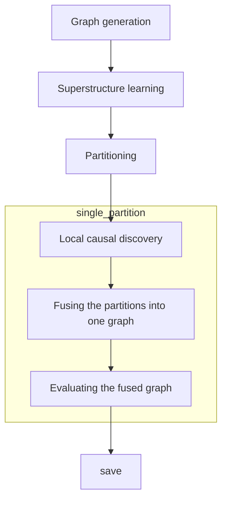

# Experiment Workflow

```mermaid
flowchart TB
    p1[Graph generation]
    p2[Superstructure learning]
    p3[Partitioning]
    p4[Local causal discovery]
    p5[Fusing the partitions into one graph]
    p6[Evaluating the fused graph]
    p7[save]
    
    p1-->p2
    p2-->p3
    p3-->p4
    subgraph single_partition
        p4-->p5
        p5-->p6
    end
    p6-->p7
```