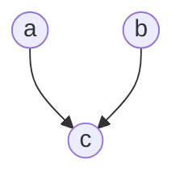

# Overview

## Key Terminology

### Colliders
A collider is a child node that shares two disconnected causal parents.

```mermaid 
flowchart TB
    a((a))
    b((b))
    c((c))
    a-->c
    b-->c
```