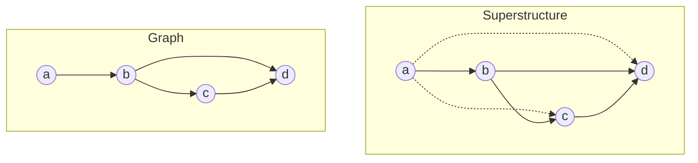
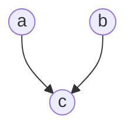

# Overview

## Key Terminology

### Superstructure
Given a true graph which forms a DAG, $G=(V,E)$, a superstructure can be understood as
a super-graph, $G'=(V,E')$, where and $E' \supset E$. Below is a visual example of a
true graph and a superstructure.

### Colliders
A collider is a child node that shares two disconnected causal parents.

